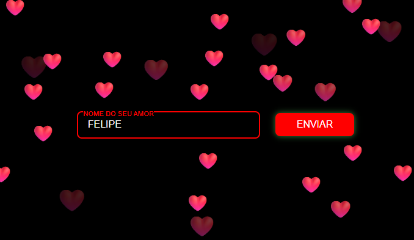

# ❤️ Projeto AmorMeu

Um projeto divertido e romântico que exibe uma animação de corações flutuando pela tela ao clicar em um botão.  
Feito com **HTML**, **CSS** e **JavaScript**, ideal para criar páginas interativas com um toque especial.

## ✨ Funcionalidades

- Campo para digitar o nome da pessoa amada ❤️
- Botão de envio que dispara a animação
- Corações flutuantes com tamanho, cor e posição aleatórios
- Animação suave feita com CSS `@keyframes`
- Layout centralizado e responsivo

## 📂 Estrutura do Projeto
├── index.html # Estrutura da página
├── visual.css # Estilos e animações
├── visual.js # Lógica para criar corações
├── audio.js # (Opcional) efeitos sonoros
├── img/
│ └── coracao2.png # Ícone da aba
├── demo.gif # Demonstração do projeto

## 🖼 Demonstração

